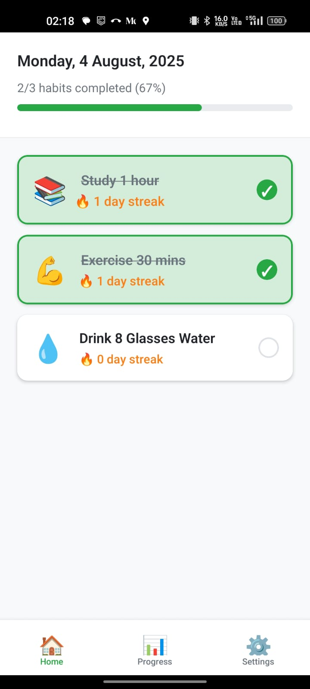
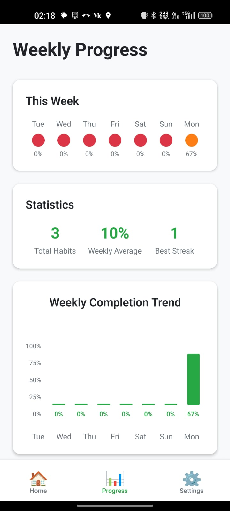
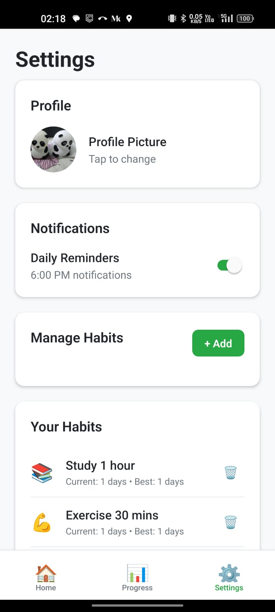

# 🌟 Daily Habit Tracker

<div align="center">


**Transform your daily routine with beautiful habit tracking** ✨

*Build consistent habits • Track your progress • Celebrate your streaks*

</div>

---

## 🎯 What is Daily Habit Tracker?

A **beautifully designed** React Native app that helps you build and maintain daily habits through visual progress tracking, motivating streak counters, and gentle daily reminders.

Whether you want to drink more water 💧, exercise regularly 💪, read daily 📚, or meditate 🧘‍♀️ - this app makes habit building **engaging and rewarding**.

## ✨ Key Features

### 🏠 **Smart Home Dashboard**
- **Today's date** with elegant formatting
- **Visual progress bar** showing daily completion percentage
- **Habit cards** with emoji icons and streak counters
- **Satisfying animations** when checking off habits
- **Motivational messages** when you complete all habits

### 📊 **Detailed Progress Tracking**
- **Weekly completion trends** with custom bar charts
- **Streak statistics** showing your best performance
- **Completion calendar** with visual indicators
- **Achievement celebrations** for consistent habits

### ⚙️ **Personalized Settings**
- **Profile picture** support with camera/gallery integration
- **Custom habit creation** with emoji selection
- **Habit management** (edit/delete existing habits)
- **Smart notifications** toggle (6 PM daily reminders)

### 🔥 **Engaging Animations**
- **Pulsing streak counters** when habits are active
- **Smooth progress animations** that respond to your actions
- **Bounce effects** on habit interactions
- **Satisfying checkmark animations**

## 🎨 Design Philosophy

### **Clean & Modern UI**
- Material Design inspired interface
- Consistent color scheme with green accents
- Smooth animations and transitions
- Intuitive navigation with bottom tabs

### **User-Centric Experience**
- **One-tap habit completion** - no complex menus
- **Visual feedback** for every interaction
- **Motivational design elements** to keep you engaged
- **Offline-first** - works without internet connection

## 🛠️ Technical Highlights

### **State Management**
- **Zustand** for lightweight, TypeScript-friendly state management
- **AsyncStorage** for local data persistence
- **Custom hooks** for reusable habit logic

### **Performance Optimized**
- **React Native Animated API** for smooth 60fps animations
- **Efficient re-rendering** with proper state management
- **Native performance** on both iOS and Android

### **Privacy-First**
- **Local-only data storage** - no external servers
- **No tracking or analytics**
- **Camera permissions** only when needed
- **Offline notifications** without Firebase dependencies

## 📱 Screenshots

<div align="center">

### 🏠 **Home Screen**
Track your daily habits with beautiful progress indicators and streak counters



### 📊 **Progress Screen** 
Visualize your weekly completion trends and habit statistics



### ⚙️ **Settings Screen**
Manage your profile, habits, and notification preferences



</div>

## 🚀 Quick Start

### **Prerequisites**
- React Native development environment
- Node.js 18+
- Android Studio or Xcode

### **Installation**
```bash
# Clone the repository
git clone https://github.com/babatezpur/HabitTracker.git

# Navigate to project directory
cd HabitTracker

# Install dependencies
npm install

# Run on Android
npm run android

# Run on iOS
npm run ios
```

## 🎯 Core Habit Loop

1. **📝 Set Your Habits** - Add custom habits with meaningful emojis
2. **✅ Daily Check-ins** - Mark habits complete with satisfying animations  
3. **🔥 Build Streaks** - Watch your consistency grow day by day
4. **📊 Track Progress** - Visualize your improvement over time
5. **🎉 Celebrate Wins** - Get motivated by your achievements

## 🧠 Psychology Behind the App

- **Visual Progress** triggers dopamine release
- **Streak Counters** leverage loss aversion psychology  
- **Daily Reminders** create consistent triggers
- **Celebration Animations** reinforce positive behavior
- **Weekly Overviews** provide long-term perspective

## 🔮 Future Enhancements

- 🏆 **Achievement System** with badges and milestones
- 📈 **Advanced Analytics** with habit correlation insights
- 👥 **Social Features** for accountability partners
- 🎨 **Theme Customization** with dark mode support
- 📱 **Widget Support** for home screen quick access

## 🤝 Contributing

We welcome contributions! Whether it's:
- 🐛 Bug fixes
- ✨ New features  
- 📚 Documentation improvements
- 🎨 UI/UX enhancements

Feel free to open issues or submit pull requests.

## 📄 License

MIT License - feel free to use this project for personal or commercial purposes.

---

<div align="center">

**Built with ❤️ and assistance from Claude AI**

*Start building better habits today!* 🌟

</div>